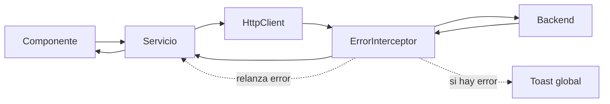

# Documentacion tecnica

## Interceptores HTTP

Actualmente la aplicacion tiene un interceptor HTTP global:

-   ErrorInterceptor en src/app/core/interceptors/error.interceptor.ts

Su registro se realiza en:

-   src/app/core/core.module.ts

Como CoreModule se importa en src/app/app.module.ts, el interceptor queda disponible para todas las peticiones HTTP realizadas con HttpClient dentro de la aplicacion.

## Que es un interceptor en Angular

Un interceptor es una capa intermedia que Angular ejecuta alrededor de cada peticion HTTP.

Permite centralizar comportamientos transversales como:

-   manejo global de errores
-   adjuntar tokens o cabeceras
-   trazabilidad o logging
-   loaders globales
-   transformacion de requests o responses

## Flujo actual en este proyecto

El flujo de una llamada HTTP es el siguiente:

1. Un componente ejecuta una accion.
2. Un servicio llama a HttpClient.
3. La request pasa por los interceptores registrados.
4. La request llega al backend.
5. La respuesta vuelve a traves de los interceptores.
6. El servicio recibe la respuesta.
7. El componente consume el resultado o el error.

Representacion simplificada:

Componente -> Servicio -> HttpClient -> ErrorInterceptor -> Backend -> ErrorInterceptor -> Servicio -> Componente

## Diagrama del flujo

## Como funciona ErrorInterceptor

La implementacion actual no modifica la request antes de enviarla. Su responsabilidad principal es escuchar errores de la respuesta HTTP y mostrar un mensaje global.

La logica es esta:

1. Ejecuta next.handle(request) para continuar la cadena.
2. Usa catchError para interceptar errores HTTP.
3. Si encuentra un mensaje de error, muestra un toast de tipo error.
4. Relanza el mismo error con throwError para que la capa llamadora pueda seguir manejandolo.

## Flujo en un caso exitoso

Cuando la llamada no falla, el interceptor practicamente actua como paso transparente:

1. El componente invoca un metodo del servicio.
2. El servicio usa HttpClient.
3. ErrorInterceptor deja pasar la request con next.handle(request).
4. El backend responde correctamente.
5. La respuesta vuelve al servicio.
6. El componente recibe los datos y actualiza la vista.

En ese escenario el interceptor no muestra mensajes ni altera la respuesta.

## Flujo en un caso con error

Cuando el backend responde con error, el recorrido cambia en el retorno:

1. La request sale normalmente.
2. El backend devuelve un HttpErrorResponse.
3. catchError dentro del interceptor captura ese error.
4. Si existe error.error.message o error.message, se muestra un toast global.
5. El interceptor relanza el error.
6. El servicio o el componente pueden capturarlo despues con su propio manejo.

Esto explica por que el interceptor no reemplaza el manejo local; solo agrega una capa global comun.

## Prioridad del mensaje mostrado

El interceptor intenta mostrar el mensaje mas util disponible con este orden:

1. error.error.message
2. error.message

Si no encuentra ninguno, no dispara el toast.

## Implicacion importante

Como el interceptor relanza el error despues de notificarlo, el componente o servicio que hizo la llamada todavia puede capturarlo.

Eso significa que hay dos niveles de manejo:

-   nivel global: el interceptor muestra una notificacion base
-   nivel local: cada flujo puede reaccionar segun su logica de negocio

## Cuando usar manejo global y cuando local

Conviene dejar en el interceptor:

-   errores tecnicos comunes
-   notificaciones genericas
-   comportamiento compartido por toda la aplicacion

Conviene manejar el error tambien en servicio o componente cuando se necesite:

-   recuperar el flujo con un fallback
-   mostrar un mensaje especifico de una pantalla
-   distinguir casos como 400, 401, 404 o 500 con reglas de negocio
-   evitar romper una experiencia concreta de usuario

## Riesgo actual

Con la implementacion actual puede haber mensajes duplicados si una pantalla muestra un toast local despues de que el interceptor ya mostro uno global.

Ese comportamiento no es un bug del interceptor; es una consecuencia natural de esta estrategia:

1. notificar globalmente
2. volver a propagar el error

## Archivos relacionados

-   src/app/core/interceptors/error.interceptor.ts
-   src/app/core/interceptors/error.interceptor.spec.ts
-   src/app/core/core.module.ts
-   src/app/app.module.ts

## Resumen

El proyecto usa un interceptor global de errores para centralizar la notificacion visual de fallos HTTP. El interceptor escucha errores, muestra un toast cuando encuentra un mensaje util y vuelve a lanzar el error para no bloquear el manejo especifico de cada caso.

## Recomendacion practica

Si en el futuro se agregan mas interceptores, conviene separar responsabilidades:

-   un interceptor para autenticacion o cabeceras
-   un interceptor para loaders
-   un interceptor para errores

Asi cada interceptor mantiene una unica responsabilidad y la cadena HTTP sigue siendo predecible y facil de depurar.

## Documentacion relacionada

-   docs/architecture-modules.md
-   docs/core.md
-   docs/status-pages.md
-   docs/utils.md
-   docs/styles.md
-   docs/task-detail.md

## Ejemplos reales afectados por el interceptor

Estos son algunos puntos concretos del proyecto donde el interceptor global participa porque la llamada termina pasando por HttpClient:

-   UserService en src/app/core/services/user.service.ts con apibpmService.getActualUser(...)
-   TaskStatusService en src/app/features/task-detail/services/task-status.service.ts con completeTask, updateTask y setTaskStatus
-   MasterDataService en src/app/features/task-detail/services/masterData.service.ts con apiTable.getSelectValues(...)
-   SearchRDRService en src/app/features/task-detail/services/search-RDR.service.ts con HttpClient directo en produccion
-   DashboardTablesComponent en src/app/features/dashboard-tables/dashboard-tables.component.ts con apitableService.getConfigurationById(...)
-   SlasDashboardComponent en src/app/features/slas-dashboard/slas-dashboard.component.ts con apitableService.getConfigurationById(...)
-   StepperModalComponent en src/app/features/task-detail/components/stepper-modal/stepper-modal.component.ts con apiTemplateService.getTemplateById(...)
-   NewOpportunityComponent en src/app/features/task-detail/components/new-opportunity/new-opportunity.component.ts con createOpportunity y getOpportunity

La explicacion detallada de la arquitectura de modulos y de estos ejemplos esta en docs/architecture-modules.md.
